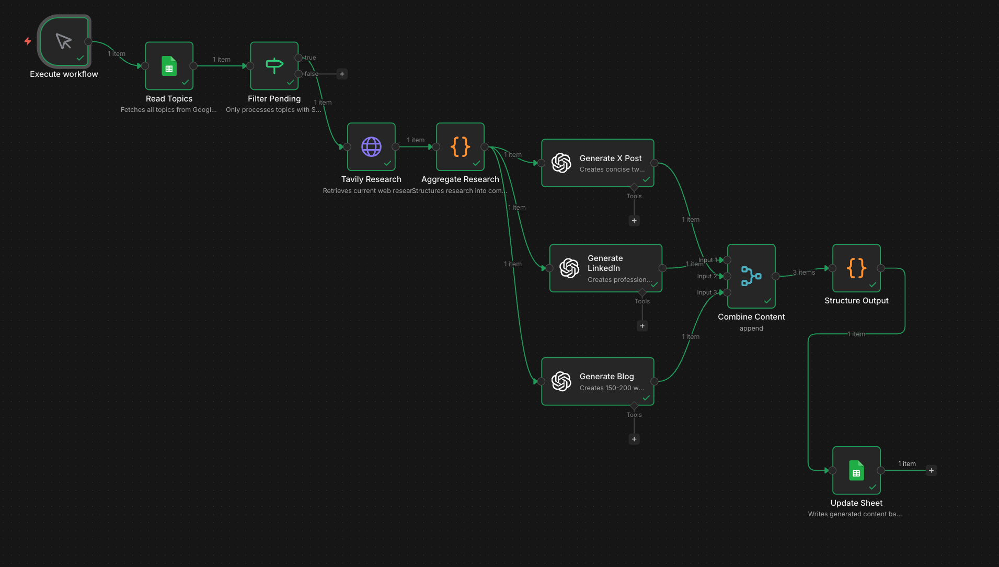

# n8n AI Content Agent

An automated content creation workflow built with n8n that transforms topics into platform-specific content for LinkedIn, X/Twitter, and blog posts using AI-powered research and generation.

## Workflow Screenshot



## Architecture

```
Manual Trigger → Read Topics (Google Sheets) → Filter Pending (IF)
    → Tavily Research (HTTP Request) → Aggregate Research (Code)
    → [Parallel: Generate LinkedIn | Generate X Post | Generate Blog] (3 OpenAI nodes)
    → Combine Content (Merge) → Structure Output (Code) → Update Sheet (Google Sheets)
```

## API Keys Required

| Service | Purpose | How to Get |
|---------|---------|------------|
| **OpenAI** | Content generation (GPT-4o-mini) | [platform.openai.com](https://platform.openai.com) |
| **Tavily** | Real-time web research | [tavily.com](https://tavily.com) |
| **Google Cloud** | Sheets API (OAuth 2.0) | [console.cloud.google.com](https://console.cloud.google.com) |

> **Note:** Actual API keys are NOT included in the workflow JSON. Configure credentials in n8n's credential system.

---

## Sample Input & Outputs

### Input Topic
```
AI agents in customer service automation
```

### LinkedIn Post Output
```
Did you know that by 2025, AI agents are predicted to dominate customer service, evolving from basic responders to sophisticated systems that handle intricate customer journeys?

We're witnessing a dramatic shift in customer support. No longer are AI agents limited to answering frequently asked questions; today, they are emotionally aware, multi-tasking systems capable of managing complex interactions. This evolution indicates not just growth, but a redefinition of what customer service can mean.

Imagine an AI that not only resolves an issue but understands the emotional state of the customer, effectively anticipating their needs. This is the future of customer service—agentic AI that can reason, plan, and execute tasks beyond simple scripts. As companies move towards integrating these intelligent solutions into their operations, the potential for increased efficiency and enhanced customer satisfaction is monumental.

Are you ready to embrace this transformation? How are you preparing your customer service strategy for the age of AI?

#CustomerService #AI #Automation #DigitalTransformation #CustomerExperience
```

### X/Twitter Post Output
```
🚨 By 2026, 70% of customer service will be powered by AI agents so advanced they can handle complex conversations! 🤖 Ready for a future where machines not only assist but transform customer experiences? The shift is happening NOW! 💡 #CustomerService #AIRevolution
```

### Blog Summary Output
```
The emergence of AI agents in customer service is transforming how businesses interact with their customers, making it critical for organizations to understand these developments. By 2025, experts predict that these autonomous systems will become integral to all facets of customer service, intelligently automating routine inquiries while enhancing the overall customer experience. AI agents are evolving from simple, rule-based chatbots into sophisticated systems capable of managing complex interactions, significantly increasing efficiency and satisfaction.

Research indicates that these advanced AI agents can reason and plan, handling more intricate conversations across various platforms. As they support human representatives, they not only streamline operations but also deliver emotional intelligence, making interactions feel more personal. A notable statistic highlights that nearly 85% of customer interactions could soon be managed by AI, underscoring the necessity for businesses to adapt to this technological shift. Embracing this evolution can position companies for future success, ultimately improving customer loyalty and operational efficiency.
```

---

## Prompt Design Rationale

### LinkedIn Prompt Design

| Design Choice | Rationale |
|---------------|-----------|
| **"Senior content strategist" persona** | Produces professional yet engaging tone appropriate for LinkedIn's business audience |
| **Hook-first structure** | LinkedIn's feed rewards scroll-stopping opening lines |
| **No bullet points** | LinkedIn algorithm favors paragraph-based posts over lists |
| **Question ending** | Posts ending with questions get 2-3x more comments, boosting algorithmic reach |
| **150-300 word range** | Optimal for mobile display without "see more" truncation |
| **3-5 hashtags** | Industry standard for discoverability without appearing spammy |

### X/Twitter Prompt Design

| Design Choice | Rationale |
|---------------|-----------|
| **Hard 280 character limit (emphasized)** | LLMs frequently exceed limits without strict prompting |
| **"Viral social media specialist" persona** | Produces punchy, attention-grabbing content |
| **Curiosity gaps** | Hints at insights outperform complete statements for engagement |
| **1-2 hashtags max** | Modern Twitter views hashtag-heavy posts as spammy |
| **Specific numbers** | Concrete data stops the scroll and builds credibility |

### Blog Summary Prompt Design

| Design Choice | Rationale |
|---------------|-----------|
| **SEO-savvy writer persona** | Ensures keyword awareness and search optimization |
| **150-200 word range** | Forces information density without sacrificing readability |
| **Context → Insights → Takeaway structure** | Mirrors how readers scan blog content |
| **Third person voice** | Increases perceived authority and professionalism |
| **At least one statistic required** | Adds credibility and concrete value |
| **No CTAs** | Summary stands alone; links added separately |

---

## How to Use

1. **Import Workflow**: In n8n, go to Workflows → Import from File → Select `n8n-ai-content-agent.json`
2. **Configure Credentials**: Add your Google Sheets OAuth, OpenAI API, and Tavily Custom Auth credentials
3. **Create Google Sheet**: Set up a sheet with columns: `Topic`, `Status`, `LinkedIn_Post`, `X_Post`, `Blog_Summary`, `Published_Date`, `Research_Summary`, `Quality_Score`
4. **Add Topics**: Enter topics with `Status = "Pending"`
5. **Execute**: Click "Execute Workflow" and watch the magic!

---

## Files Included

| File | Description |
|------|-------------|
| `n8n-ai-content-agent.json` | n8n workflow export (import this) |
| `n8n-ai-content-agent.png` | Workflow screenshot |
| `README.md` | This documentation file |

---

## Performance

| Metric | Value |
|--------|-------|
| Execution time | ~35 seconds |
| Tokens per topic | ~2,500 |
| Cost per topic | ~$0.005 (GPT-4o-mini) |

---

## License

MIT License - feel free to use, modify, and distribute.
